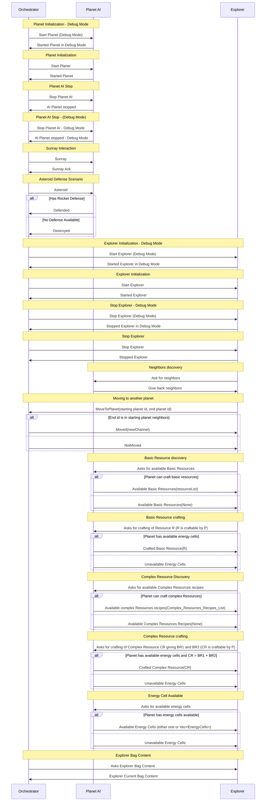

# AP project sequence diagram

```mermaid
sequenceDiagram
    participant O as Orchestrator
    participant P as Planet AI
    participant E as Explorer


    %%Planet - Orchestrator (Debug Mode)
    Note over O,P: Planet Initialization - Debug Mode
    O->>P: Start Planet (Debug Mode)
    P->>O: Started Planet in Debug Mode
    
    %%Planet - Orchestrator
    Note over O,P: Planet Initialization
    O->>P: Start Planet
    P->>O: Started Planet

    Note over O,P: Planet AI Stop
    O->>P: Stop Planet AI
    P->>O: AI Planet stopped
    
    Note over O,P: Planet AI Stop - (Debug Mode)
    O->>P: Stop Planet AI - Debug Mode
    P->>O: AI Planet stopped - Debug Mode

    Note over O,P: Sunray Interaction
    O->>P: Sunray
    P->>O: Sunray Ack

    Note over O,P: Asteroid Defense Scenario
    O->>P: Asteroid
    alt Has Rocket Defense
        P->>O: Defended
    else No Defense Available
        P->>O: Destroyed
    end

    %%Orchestrator - Explorer
    Note over O,E: Explorer Initialization - Debug Mode
    O->>E: Start Explorer (Debug Mode)
    E->>O: Started Explorer in Debug Mode
    
    Note over O,E: Explorer Initialization
    O->>E: Start Explorer
    E->>O: Started Explorer

    Note over O,E: Stop Explorer - Debug Mode
    O->>E: Stop Explorer (Debug Mode)
    E->>O: Stopped Explorer in Debug Mode
    
    Note over O,E: Stop Explorer
    O->>E: Stop Explorer
    E->>O: Stopped Explorer

    %%Explorer - Planet
    Note over E,P: Neighbors discovery
    E->>P: Ask for neighbors
    P->>E: Give back neighbors

    Note over E,O: Moving to another planet
    E ->> O: MoveToPlanet(starting planet id, end planet id)
    alt End id is in starting planet neighbors
        O ->> E: Moved(newChannel)
    else
        O ->> E: NotMoved
    end

    Note over E,P: Basic Resource discovery
    E ->> P: Asks for available Basic Resources
    alt Planet can craft basic resources
        P ->> E: Available Basic Resources(resourceList)
    else
        P ->> E: Available Basic Resources(None)
    end

    Note over E,P: Basic Resource crafting
    E ->> P: Asks for crafting of Resource R (R is craftable by P)
    alt Planet has available energy cells
        P ->> E: Crafted Basic Resource(R)
    else
        P ->> E: Unavailable Energy Cells
    end

    Note over E,P: Complex Resource Discovery
    E ->> P: Asks for available Complex Resources recipes
    alt Planet can craft complex Resources
        P ->> E: Available complex Resources recipes(Complex_Resources_Recipes_List)
    else
        P ->> E: Available Complex Resources Recipes(None)
    end

    Note over E,P: Complex Resource crafting
    E ->> P: Asks for crafting of Complex Resource CR giving BR1 and BR2 (CR is craftable by P)
    alt Planet has available energy cells and CR = BR1 + BR2
        P ->> E: Crafted Complex Resource(CR)
    else
        P ->> E: Unavailable Energy Cells
    end

    Note over E,P: Energy Cell Available
    E ->> P: Asks for available energy cells
    alt Planet has energy cells available
        P ->> E: Available Energy Cells (either one or Vec<EnergyCells>)
    else
        P ->> E: Unavailable Energy Cells
    end

    Note over O,E: Explorer Bag Content
    O ->> E: Asks Explorer Bag Content
    E ->> O: Explorer Current Bag Content


```